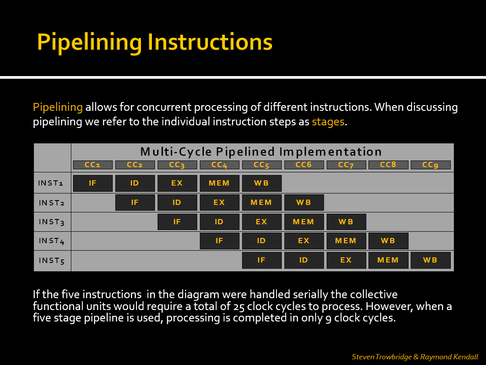
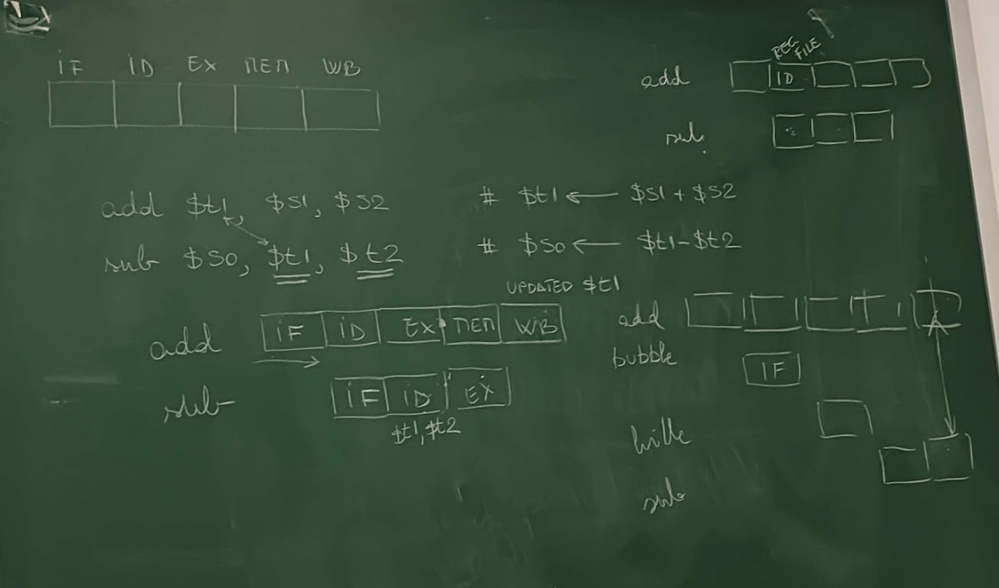
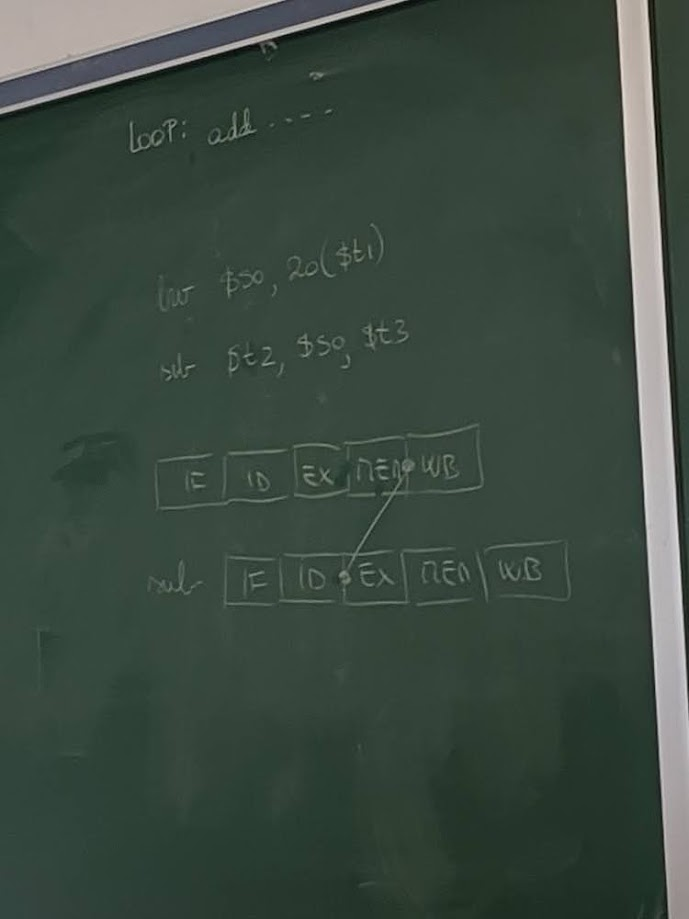

# CSCI 343 April 3: MIPS Pipelining, Parallelism, and Hazards

---

## Overview

This lecture focused on **instruction-level parallelism** via **pipelining** in MIPS architecture, a technique designed to improve performance by increasing instruction throughput. Key topics included:

- The five-stage instruction cycle
- Parallelism through pipelining
- Hazards in pipelining: structural, data, and control
- Techniques to handle data hazards: stalling, forwarding, and delayed branching
- Why MIPS is ideal for pipelining
- Pipeline timing and speedup
- Hardware support for pipeline optimization
- Real-world analogies and examples

---

## Five-Stage Instruction Cycle in MIPS

Each MIPS instruction may go through the following five stages:

1. **Instruction Fetch (IF)** - Access instruction memory
2. **Instruction Decode (ID)** - Decode and read register operands
3. **Execute (EX)** - Perform ALU operations
4. **Memory Access (MEM)** - Read/write data memory (only for load/store)
5. **Write Back (WB)** - Write result to register file

> Not every instruction uses every stage actively, but all must pass through each stage in a pipelined design.

Some instructions like R-format skip MEM, and store instructions skip WB. Branch instructions may skip both MEM and WB. However, all must move through all stages to maintain pipeline structure and timing.

### Key Idea

Each stage uses a different hardware component (e.g., instruction memory, register file, ALU, data memory), allowing multiple instructions to proceed in parallel without interference.

---

## Pipelining Basics

Pipelining increases throughput by overlapping stages of multiple instructions. Each pipeline stage operates on a different instruction during the same clock cycle.

### Analogy: Doing Laundry

- Tasks: wash → dry → fold → store
- Instead of waiting for one load to finish before starting another, each stage is continuously active on a different load
- Pipeline performs like a laundry assembly line: once the line is full, each step outputs a finished product every cycle

### Requirements for Pipelining:

- No two instructions can use the same hardware unit in the same clock cycle
- All instructions must progress through the pipeline stages in order

## Advantages of Pipelining

To illustrate how pipelining reduces total clock cycles, refer to the diagram linked below:



- In a **non-pipelined** (serial) approach, each instruction must complete before the next begins. With five instructions and five stages, this would take 25 cycles.
- In a **pipelined** CPU, overlapping stages allows all five instructions to complete in just **9 clock cycles**.

---

- **Throughput Improvement**: Completes more instructions per unit time (not faster individual instructions)
- **Efficiency**: Better hardware utilization compared to single-cycle CPUs
- **Example**:
  - Single-cycle: 5 instructions × 800ps = 4000ps
  - Pipelined: 9 cycles × 200ps = 1800ps (more than 2× improvement)

---

## Pipeline Timing & Speedup

- Pipeline clock cycle is set to the **slowest** stage (typically MEM or EX)
- With each instruction taking 5 stages, a pipeline allows completion of one instruction per cycle **after the pipeline is full**

```
Pipeline Time = (n + k - 1) × t
where:
    n = number of instructions
    k = number of stages (5 for MIPS)
    t = clock cycle time (determined by slowest stage)
```

This formula calculates the total time required to execute `n` instructions through a pipeline with `k` stages and clock cycle time `t`. It reflects the idea that the first instruction takes `k` cycles to complete, and each additional instruction completes in one additional cycle.

In the Pipeline visualization above:

- We can see how the pipeline fills up over the first few cycles.
- Once full, each new instruction completes every cycle.
- With 5 instructions and a 5-stage pipeline, the total time is 9 cycles, coinciding with the formula stated above: `(5 + 5 - 1) × t = 9 × t`.

- **Ideal Speedup** ≈ number of stages (5), but actual speedup is less due to hazards and pipeline filling/draining overhead

---

## MIPS Design and Pipelining

MIPS architecture is designed with pipelining in mind. Features include:

- **Fixed-length instructions** (32 bits) simplify fetching and decoding
- **Regular instruction formats** share field locations (opcode, rs, rt, etc.)
- **Load/store architecture** restricts memory access to only two instructions, simplifying memory stage handling
- **Aligned memory accesses** ensure word-based access boundaries

These choices allow each pipeline stage to be predictable and efficient, with less complex control logic.

---

## Pipeline Hazards

Pipeline hazards are issues that prevent the next instruction from executing during its designated clock cycle.

### 1. Structural Hazards

- **Cause**: Two instructions attempt to use the same hardware component simultaneously
- **Solution**: MIPS avoids these by design (e.g., separate instruction/data memory)

### 2. Data Hazards

- **Cause**: Dependency between instructions (e.g., one instruction needs a result from another still in progress)
- **Types**:
  - **RAW (Read-After-Write)**: Most common (e.g., `add $t1, $t2, $t3` followed by `sub $t4, $t1, $t5`)

```asm
add $t1, $s1, $s2
sub $s0, $t1, $t2  # Depends on result of add
```

#### Solutions:

- **Stalling (Bubbles)**

  - Pipeline inserts NOPs to delay dependent instruction
  - Implemented using a **hazard detection unit**, which sets control signals to zero to pause progress

- **Forwarding (Bypassing)**
  - Directly route results from EX/MEM or MEM/WB stages to dependent instructions
  - Done using a **forwarding unit** and multiplexers

### Load-Use Hazard

- **Special Case**: Load data isn’t available until MEM stage, requiring a stall + forward combo.

```asm
lw $s0, 0($t1)
sub $t2, $s0, $t3  # Requires stall before forwarding
```



### 3. Control Hazards (Branch Hazards)

- **Cause**: Branches alter instruction flow, but the next instruction is fetched before branch resolution

#### Solutions:

- **Flush**: Discard wrong instruction if prediction was incorrect
- **Branch prediction**: Guess the likely path; dynamic algorithms can improve accuracy
- **MIPS Approach - Delayed Branching**:
  - Always fetch the **next** instruction after the branch
  - The next instruction (delay slot) is always executed, regardless of branch result
  - Compiler reorders code to place useful instructions in the delay slot
  - **Static prediction**: MIPS assumes branches are not taken

---

## Pipeline Registers & Forwarding Unit

Pipeline registers isolate each stage and store information needed by subsequent stages. This supports overlapping execution and forwarding.

### Typical Inter-Stage Registers:

- **IF/ID**: Holds fetched instruction and PC+4
- **ID/EX**: Holds control signals, register values, and sign-extended immediate
- **EX/MEM**: Holds ALU result, control signals, and destination register
- **MEM/WB**: Holds data from memory or ALU result to write back

### Forwarding Unit

- Contains multiplexers that bypass pipeline registers to feed results directly to dependent stages
- Used to resolve most RAW data hazards without stalling

---

## Performance Comparison

| Model            | Instructions | Clock Cycles | Clock Time | Total Time |
| ---------------- | ------------ | ------------ | ---------- | ---------- |
| Single-cycle CPU | 5            | 5 × 800 ps   | 800 ps     | 4000 ps    |
| Pipelined CPU    | 5            | 9 cycles     | 200 ps     | 1800 ps    |

- The pipeline requires extra cycles at the beginning and end (startup + wind-down)
- With large programs (e.g., 10,000+ instructions), pipeline stays **fully utilized**, and overhead becomes negligible
- Real performance boost comes from **throughput**, not faster individual instruction execution

---

## Example Problems

### **Data Hazard with Forwarding**

```asm
add $s0, $s1, $s2
sub $t0, $s0, $s3  # Forward $s0 from EX to EX
```

### **Load-Use Hazard**

```asm
lw $s0, 0($t0)
add $t1, $s0, $t2  # Requires 1 stall cycle + forwarding
```

---

## Summary of Hardware Support for Pipelining

- **Forwarding Unit**: Enables bypassing of values to avoid unnecessary stalls
- **Hazard Detection Unit**: Inserts NOPs (bubbles) when data hazards are unavoidable
- **Control Unit**: Modified to manage stalls, flushing, and branch decisions
- **Pipeline Registers**: Store and isolate stage-specific values to support concurrent processing

---

## Exam Notes

- Understand the function of each pipeline stage and what hardware it uses
- Be able to draw a pipeline execution chart for a sequence of instructions
- Identify and explain the type of hazards between instructions
- Demonstrate both stalling and forwarding solutions for data hazards
- Know how MIPS design simplifies pipelining and supports delayed branching
- Calculate clock cycles and performance gains for pipelined vs. single-cycle execution
- Explain why load-use hazards require stalling even with forwarding

---

## Suggested Reading

- **Hennessy & Patterson textbook** chapters on pipelining, data hazards, and control hazards
- PowerPoint slides posted on Brightspace for pipeline and hazard diagrams
- Study older student presentations (e.g., by Steven Trowbridge & Raymond Kendall)
- Practice interpreting pipeline diagrams like the one above

---


