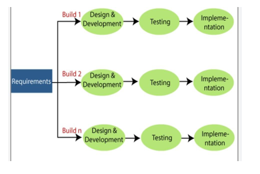
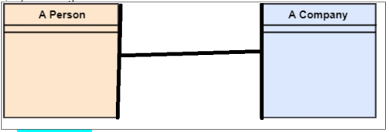

<style>
  details {
    margin: 10px 0;
  }

  details {
    background-color:rgb(81, 161, 247);
    color: white;
    padding: 10px 20px;
    border: none;
    border-radius: 5px;
    cursor: pointer;
    font-weight: bold;
    text-align: center;
    transition: background-color 0.3s;
    display: inline-block;
  }

  details:hover {
    background-color: #0056b3;
  }

  details[open] {
    background-color: #28a745;
  }

@media (max-width: 600px) {
  details {
    font-size: 1.2rem !important;
  }
  details summary {
    font-size: 1.2rem !important;
  }
  details p {
    font-size: 1.2rem !important;
  }
}

</style>

### Q2) Functional vs Non-Functional refers to

- a) Prototype
- b) Requirements
- c) Testing
- d) Architecture
- e) Maintenance

<details>
<summary>Show Answer</summary>

**Correct Answer:** b) Requirements

</details>

&nbsp;

### Q5) Benefits of using cloud software.

- a) No need for maintenance (for clients)
- b) Availability
- c) Scalability
- d) Less staff required
- e) All the above

<details>
<summary>Show Answer</summary>

**Correct Answer:** e) All the above

</details>

&nbsp;

### Q8) The Strategy pattern replaces inheritance with \***\*\_\_\*\***.

<details>
<summary>Show Answer</summary>

**Correct Answer:** Composition

</details>

&nbsp;

### Q11)

```java
public class Geometry {
    int area(int height, int width) {
        return height * width;
    }

    int volume(int height, int width, int depth) {
        int area = height * width;
        return area * depth;
    }
}
```

The above code violates:

- a) YAGNI
- b) DRY
- c) Dependency Inversion
- d) Liskov Substitution
- e) Single Responsibility

<details>
<summary>Show Answer</summary>

**Correct Answer:** b) DRY

</details>

&nbsp;

### Q14) Which of the following are true? (Note: More than one can be true.)

```java
public class MedicalRecord {
    public Database database;

    public MedicalRecord(Database database) {
        this.database = database;
    }
}
```

- a) **MedicalRecord** and **Database** have an IS-A relationship
- b) **MedicalRecord** composes the **Database** object
- c) **Database** is encapsulated (False because Database is public)
- d) **MedicalRecord** is dependent on **Database**
- e) **MedicalRecord** and **Database** have a HAS-A relationship

<details>
<summary>Show Answer</summary>

**Correct Answers:** b), d), e)

</details>

&nbsp;

### Q17) Which of these do not involve incremental development.

- 1. Xtreme Programming
- 2. Agile
- 3. Scrum
- 4. Software Reuse
- 5. Iterative development

<details>
<summary>Show Answer</summary>

**Correct Answer:** 4) Software Reuse

</details>

&nbsp;

### Q20) Which Design Pattern uses the principle, _Open for Extension Closed for Modification_?

- 1. Observer
- 2. Strategy
- 3. All the above
- 4. None of the above

<details>
<summary>Show Answer</summary>

**Correct Answer:** 3) All the above

</details>

&nbsp;

### Q23) Challenges facing software engineers.

- 1. New technologies
- 2. Reduced delivery times
- 3. Developing trustworthy software
- 4. Global Competition
- 5. All the above

<details>
<summary>Show Answer</summary>

**Correct Answer:** 5) All the above

</details>

&nbsp;

### Q26)

```java
public interface Bank {
    void borrow();
}

public class BankOfFrance implements Bank {
    public void borrow() {}
}

public class BankOfSpain implements Bank {
    public void borrow() {}
}

public class FinancialInstitutions {
    List<BankOfFrance> frenchBanks = new ArrayList<>();
    List<BankOfSpain> spanishBanks = new ArrayList<>();

    public void borrowFromBanks() {
        for(BankOfFrance b : frenchBanks)
            b.borrow();

        for(BankOfSpain b : spanishBanks)
            b.borrow();
    }
}
```

Which of the following is true?

- 1. **FinancialInstitutions** class is using Inheritance
- 2. **FinancialInstitutions** class should use composition
- 3. **BankOfFrance** should use `extends` rather than `implements`
- 4. **FinancialInstitutions** is closed for modification
- 5. **FinancialInstitutions** should use the Observer pattern

<details>
<summary>Show Answer</summary>

**Correct Answer:** 5) FinancialInstitutions should use the Observer pattern

</details>

&nbsp;

### Q32) Regarding the singleton pattern, the following is true:

- a) Only one instance of an object
- b) Protects access to global object
- c) Object can be created first time it is used
- d) Object can be created when program starts or at runtime
- e) All the above

<details>
<summary>Show Answer</summary>

**Correct Answer:** e) All the above

</details>

&nbsp;

### Q38) The following is true about incremental development…

- 1. Customer involvement is not recommended
- 2. All requirements are determined before coding
- 3. Easy to make modifications (change requirements)
- 4. Code does not need refactoring
- 5. Only testing done is unit testing

<details>
<summary>Show Answer</summary>

**Correct Answer:** 3) Easy to make modifications (change requirements)

</details>

&nbsp;

### Q41) Software specification, software development, \***\*\_\_\*\***, software evolution. Which step is missing above?

<details>
<summary>Show Answer</summary>

**Correct Answer:** Testing

</details>

&nbsp;

### Q44) Software for the following are usually developed using different process models:

- 1. refrigerator software and medical software
- 2. airplane software and medical software
- 3. game software and medical software
- 4. Scalable software and software that can handle unlimited users
- 5. your web site with Amazon checkout and using 3rd party graphics library for your game software

<details>
<summary>Show Answer</summary>

**Correct Answer:** 3) game software and medical software

</details>

&nbsp;

### Q47)

- a) Feasibility
- b) Requirements
- c) Design
- d) Development
- e) Testing

These steps should be performed in the following order:

- 1. A), B), C), D), E)
- 2. D), B), C), A), E)
- 3. A), C), D), B), E)
- 4. Any order is OK
- 5. B), C), D), E), A)

<details>
<summary>Show Answer</summary>

**Correct Answer:** 1) A), B), C), D), E)

</details>

&nbsp;

### Q50) The following type of software can possibly be reused for many different projects:

- 1. System
- 2. Object
- 3. Component
- 4. Web service
- 5. All the above

<details>
<summary>Show Answer</summary>

**Correct Answer:** 5) All the above

</details>

&nbsp;

### Q56) Which process model is represented by the image below?

- 1. WaterFall
- 2. V Model
- 3. Incremental model
- 4. Re-Use Model
- 5. Step model



<details>
<summary>Show Answer</summary>

**Correct Answer:** 3) Incremental Model

</details>

&nbsp;

### Q59) RE UL: The image below represents:


<details>
<summary>Show Answer</summary>

**Correct Answer:** Inheritance

</details>

&nbsp;

### Q65) Which process model is represented by the image below?

- 1. Association
- 2. Abstraction
- 3. Encapsulation
- 4. Polymorphism
- 5. Inheritance



<details>
<summary>Show Answer</summary>

**Correct Answer:** 1) Association

</details>

&nbsp;

### Q68) Which class below is the optimal way to design code?

The one that uses composition i.e. Line 4

```java
public interface IDatabase {}

// Line 1:
public class Accounting extends Database {}

// Line 2:
public class Accounting implements IDatabase {}

// Line 3:
public class Accounting {
    IDatabase database;
}

// Line 4:
public class Accounting {
    Database database;
}

// Line 5:
public class Accounting {
    Object database;
}
```

<details>
<summary>Show Answer</summary>

**Correct Answer:** Line 4 - The one that uses composition

</details>

&nbsp;

### Q71) I am concerned over the large turnover of staff. I am concerned about my software being:

- 1. Dependable – work w/out crashing
- 2. Usable – easy to use
- 3. Scalable – can grow with demand
- 4. Efficient – won’t waste computer resources
- 5. Maintainable – easy to fix (because with everyone coming and going knowledge about the code is easily lost)

<details>
<summary>Show Answer</summary>

**Correct Answer:** 5) Maintainable

</details>

&nbsp;

### Q74) Degree necessary to be a software engineer:

- 1. Computer Science
- 2. Computer Science and Management
- 3. Information Technology
- 4. Computer Science and Hardware
- 5. None of the above

<details>
<summary>Show Answer</summary>

**Correct Answer:** 5) None of the above

</details>

&nbsp;

### Q77) Regarding the following:

- Testing (a)
- Operational manual (b)
- Java Code (c)
- Requirements Document (d)
- Technical Documentation (e)
- Financing (f)

Which of the following is true?

- 1. Only (a)(b)(c)(d)(e) are part of a software project
- 2. Only (a)(b)(c) are part of a software project
- 3. Only (c) is part of a software project
- 4. All must be written by software developers
- 5. All must be written by technical writers

<details>
<summary>Show Answer</summary>

**Correct Answer:** 1) Only (a)(b)(c)(d)(e) are part of a software project

</details>

&nbsp;

### Q80) Which process model requires Software Discovery?

- 1. Discovery model
- 2. Software model
- 3. Iterative model
- 4. V model
- 5. Re-use model

<details>
<summary>Show Answer</summary>

**Correct Answer:** 5) Re-use model

</details>

&nbsp;
