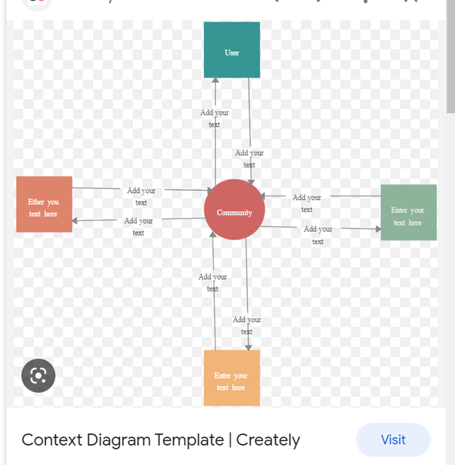

# CSCI 370 Lecture 17: Functional vs Non-Functional Requirements, Use Case Modeling, and UML Diagrams

<small>Tuesday, April 22</small>

---

## Functional vs Non-Functional Requirements

### Functional Requirements

Functional requirements are specific declarations of behaviors, functions, or services that the system must perform. These are generally defined as "what" the system should do. They can be derived from user needs, system goals, or business requirements.

**Examples include:**

- Allowing users to register with an email address.
- Authenticating login credentials.
- Generating monthly reports.
- Supporting CRUD operations (Create, Read, Update, Delete).

Functional requirements are easy to test due to their specificity. You can directly verify whether a feature such as "create a new user account" works as expected.

### Non-Functional Requirements

Non-functional requirements describe the quality attributes of a system and how the system performs certain operations. These are often referred to as "constraints" or "-ilities" (e.g., scalability, usability).

**Examples include:**

- Performance (response time, throughput)
- Reliability (uptime, failure rates)
- Portability (ability to run on different platforms)
- Usability (ease of learning/use)
- Maintainability (ease of bug fixes or updates)
- Security (access control, encryption)

Non-functional requirements are harder to define and test. Unlike functional ones that describe direct user interaction, these qualities affect user satisfaction, long-term robustness, and performance.

#### Why Measuring Non-Functional Requirements Is Hard

Because qualities like "easy to use" or "fast" are subjective, it's critical to make them measurable:

- Instead of "fast": specify "system must respond within 2 seconds under 100 concurrent users"
- Instead of "portable": define "the application must run unmodified on Windows 10, macOS 12, and Ubuntu 22.04"

**Example Table of Non-Functional Requirements:**

| **Property** | **Measure**                                                              |
| ------------ | ------------------------------------------------------------------------ |
| Speed        | Transactions/sec, Page load time, Screen refresh time                    |
| Size         | Memory footprint (RAM usage during peak), Installation size              |
| Ease of Use  | Average user training time (hours), Number of clicks for primary task    |
| Reliability  | Mean time between failures, System uptime                                |
| Robustness   | Percentage of successful recovery after crash, Handling of invalid input |
| Portability  | # of platforms supported, % of shared codebase across OSes               |

---

## 🛍️ Ethnography in Software Engineering

Ethnography involves observing users in their natural work environments to understand how systems are used in practice. It's a method for gathering insights into human behaviors, workflows, and constraints that might not be captured through interviews or written requirements.

### Why It's Important

1. **Real-World Constraints:** Users may be in loud, poorly lit environments, or might rely on touch interfaces.
2. **Tool Usage:** Users might use calculators, phones, or other tools alongside the application.
3. **Accessibility Needs:** Children, elderly, or users with disabilities might require specialized interface elements.
4. **System Integration:** Understanding if users switch between applications or depend on specific workflows.

### Boeing 737 MAX Example

A real-world example of misjudged usability is the Boeing 737 MAX crashes, where Boeing asserted that no pilot retraining was required for the new system—despite critical changes. Ethnographic insights might have identified that assumption as dangerous, especially when training time was used as a selling point.

---

## 📋 Use Case Table

Use Case Tables describe system functionality from the end user's perspective and are typically used by business analysts. Each table documents a single interaction scenario.

### Components of a Use Case Table

- **Actors**: External entities (users or other systems) that interact with the system
- **Goal**: What the actor intends to achieve
- **Preconditions**: Conditions that must be true before the scenario begins
- **Basic Flow**: Step-by-step list of interactions
- **Alternative Flow**: Exceptions or alternate scenarios
- **Postconditions (Success Scenario)**: State of the system if all steps complete successfully

### Example 1: Washing Machine

- **Actor**: Laundry customer
- **Goal**: Clean clothes
- **Preconditions**: Clothes are placed in the machine, detergent is loaded
- **Basic Flow**:

  1. User selects wash settings
  2. User starts machine
  3. Machine completes wash cycle

- **Alternative Flow**: Machine fails to start due to door left open
- **Success**: Clothes are clean and user removes them

### Example 2: Website Login

- **Actor**: Website visitor
- **Goal**: Access account
- **Preconditions**: User has valid credentials
- **Basic Flow**:

  1. Enter username
  2. Enter password
  3. Submit login form

- **Alternative Flow**: Password is incorrect
- **Success**: User is redirected to dashboard

Use Case Tables are formal and can run multiple pages for complex systems. They are often used in agile or waterfall development cycles to ensure requirements coverage.

---

## 🔸 Use Case Diagram

### Purpose

A Use Case Diagram is a visual summary of the high-level functionality of a system and its external interactions.

### Diagram Components

- **Actors**: Represented by stick figures outside the system boundary
- **System Boundary**: A rectangle containing the system's use cases
- **Use Cases (Activities)**: Ovals representing system features from the user's perspective
- **Associations**: Lines connecting actors to the use cases they interact with

### Sample Use Case Diagram (Online Shopping System)

- See  for visual reference
- **Actors**: Customer, Authentication Server, Identity Provider, Payment Gateway
- **Use Cases**:

  - View Items
  - Log In
  - Make Purchase
  - Complete Checkout

Each line between an actor and a use case represents a direct interaction. Diagrams are meant to be quick, informal sketches to understand system scope.

---

## 🔎 Context Diagram

### Purpose

A Context Diagram presents a system as a single process and shows how it interfaces with external entities. It's used to identify all actors and systems that communicate with the main system.

### Diagram Elements

- **System**: Represented as a circle or box
- **External Entities**: Labeled boxes surrounding the system
- **Data Flows**: Arrows showing the direction of data or control

### Example:

- System: Community Management Portal
- External Systems: Admin, Commentators, Content Reviewers, Members
- Data Flows:

  - Comments submitted by Members
  - Approvals by Moderators
  - Feedback from Commentators

These diagrams are intentionally simple and focus only on data exchange, not internal logic.

---

## ⚖️ UML Process (Activity) Diagrams

### Purpose

Process models (also known as Activity Diagrams) describe the flow of control or data in a system. They model dynamic behavior and can illustrate workflows, use case scenarios, and business processes.

### Common Elements

- **Initial Node**: Solid circle (entry point)
- **Activity Node**: Rounded rectangle
- **Decision Node**: Diamond (for branching logic)
- **Fork Node**: Thick horizontal/vertical bar (start of parallel processes)
- **Join Node**: Thick horizontal/vertical bar (end of parallel processes)
- **Final Node**: Solid circle within a ring (exit point)

### Sample Workflow (Mental Health Admission)

- **Start**: Confirm Detention Decision
- **Parallel Activities**:

  - Inform Patient of Rights
  - Record Detention Decision

- **Decision Node**: Is patient dangerous?

  - Yes → Find Secure Place

    - If none available → Temporarily hold in police station
    - If available → Transfer to secure facility

  - No → Admit to regular hospital

- **Join**: Finalize Admission
- **End**: Close case

This shows how decisions, concurrent operations, and outcomes are captured visually.

---

## Summary

This lecture emphasized modeling system requirements through diagrams and descriptive tables:

- **Functional vs Non-Functional Requirements**: Identifying "what" vs "how" a system performs
- **Use Case Tables and Diagrams**: Capturing user interactions and activities
- **Context Diagrams**: Clarifying system boundaries and external data flows
- **Activity Diagrams**: Mapping process logic and control flow
- **Ethnography**: Highlighting the value of understanding user context

Grasping these foundational diagrams equips students with tools to model real-world systems more accurately and communicate technical needs effectively in both academic and professional settings.
