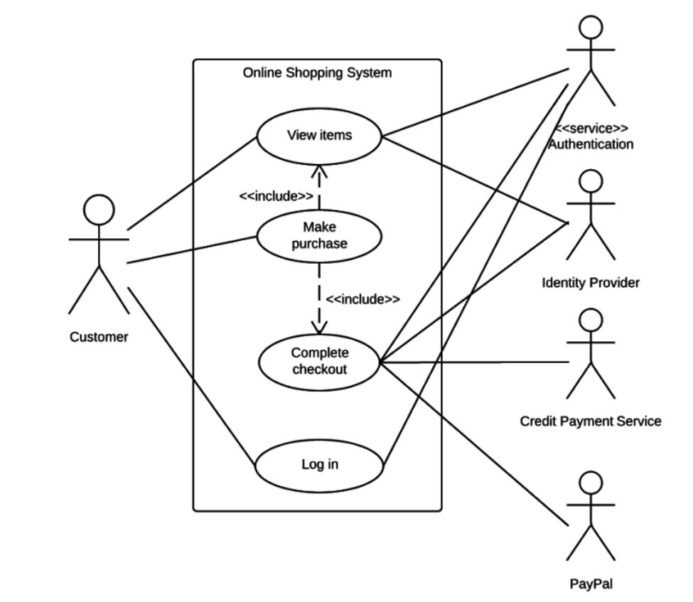
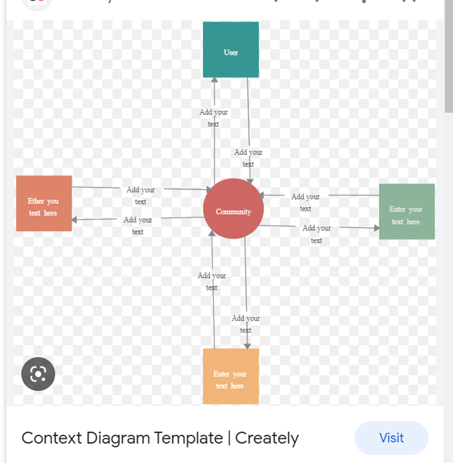
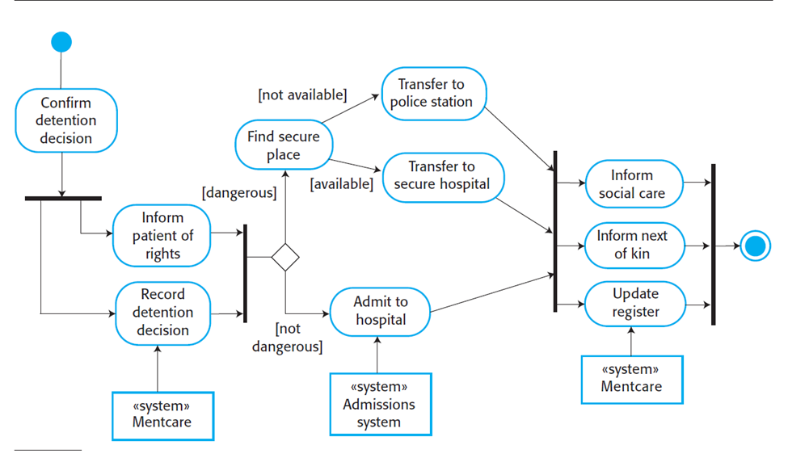

# CSCI 370 Lecture 17: Functional vs Non-Functional Requirements, Use Case Modeling, and UML Diagrams

<small>Tuesday, April 22</small>

---

## Functional vs Non-Functional Requirements

### Functional Requirements

Functional requirements define the specific behavior or functions of a system, essentially detailing what the system should do. These are based directly on user goals and tasks. They are concrete, measurable, and easy to verify during testing.

#### Key Characteristics:

- Specific to individual system functions
- Directly map to user interactions
- Expressed in the form "The system shall..."

#### Examples:

- "The system shall allow a user to log in with a valid email and password."
- "The system shall generate a printable monthly report for administrators."
- "The system shall send a confirmation email after successful registration."

These types of requirements often correspond directly to features in the UI or system API.

### Non-Functional Requirements

Non-functional requirements (NFRs) define constraints on how the system operates rather than what it does. These requirements affect the performance, usability, reliability, and maintainability of a system.

#### Examples:

- Performance: "System should support up to 500 concurrent users."
- Reliability: "System uptime should be at least 99.9% per month."
- Usability: "New users should be able to complete registration in under 5 minutes."
- Security: "User data must be encrypted at rest and in transit."
- Portability: "Application should run on Windows, macOS, and Linux without modification."

Quantifying NFRs is essential for testability. Vague goals like "fast" or "user-friendly" must be made concrete.

#### Sample Table:

| Property    | Metric Example                                 |
| ----------- | ---------------------------------------------- |
| Speed       | < 2s response time for 90% of requests         |
| Size        | Under 50MB installation footprint              |
| Ease of Use | Max 15 min training time for basic usage       |
| Reliability | Mean time between failures (MTBF) > 1000 hours |
| Robustness  | System resumes within 10s of failure           |
| Portability | Runs on 3 major OSs with same codebase         |

---

## 🛍️ Ethnography in Software Engineering

Ethnography is a qualitative research method that involves observing real users in their working context to understand needs, habits, limitations, and environmental factors that affect software use.

### Key Goals:

- Understand hidden workflows and user behavior
- Capture edge cases or tools in use outside the designed system
- Support inclusive design for varied user demographics

### Examples:

1. In an airport traffic control tower, software may be used by multiple people glancing at shared screens. Accessibility, font size, and multitasking are critical.
2. Children using educational software may be unfamiliar with keyboard shortcuts or abstract icons, affecting UI decisions.
3. Users might rely on external tools like calculators or phone apps concurrently with your software.

### Design Implication:

These observations affect decisions such as:

- Screen layout
- Visual clarity
- Workflow alignment
- Help and documentation accessibility

---

## 📋 Use Case Table

Use Case Tables formally describe interactions between actors (users or systems) and the system. They help identify and validate system requirements through structured scenarios.

### Use Case Components:

- **Actors**: Initiators or participants in the interaction
- **Goal**: What the actor intends to achieve
- **Preconditions**: What must be true before the scenario begins
- **Main (Basic) Flow**: Step-by-step normal scenario
- **Alternative Flows**: Deviations or exceptions
- **Postconditions**: Outcome if flow completes successfully

### Example: Library Book Loan Use Case

**Description**: User borrows one or more books

**Precondition**: User has library card, picked up books, has no penalties, has not exceeded limit

#### Ordinary Sequence:

| Step | Action                                                   |
| ---- | -------------------------------------------------------- |
| 1    | Librarian starts loan registration process               |
| 2    | System requests user ID                                  |
| 3    | Librarian inputs user ID                                 |
| 4    | System requests book IDs                                 |
| 5    | Librarian inputs book info                               |
| 6    | System calculates return dates and asks for confirmation |
| 7    | User confirms selected books and dates                   |
| 8    | Librarian re-confirms selections                         |
| 9    | System registers the loans and confirms                  |

**Postcondition**: Books are registered as loaned; user can take them

**Exception at Step 3**: If user has reached loan limit or has penalty, system cancels request and informs librarian

**Comment**: Loan rules follow library policy (CRQ-0003, CRQ-0014)

---

## 🔸 Use Case Diagram

Use case diagrams summarize high-level user-system interactions visually.

**Elements:**

- **Actors**: Represented as stick figures (e.g., users, external systems)
- **System Boundary**: Rectangular box containing all use cases
- **Use Cases**: Ovals indicating actions/functions
- **Relationships**: Lines or arrows (solid for interactions, dashed for <<include>> or <<extend>>)

**Example: Online Shopping System**

- Customer uses: View Items, Log In, Make Purchase, Complete Checkout
- System includes external authentication, credit card validation, PayPal support
- <<include>> is used to show reused logic like "Log In" being part of all main features

Use case diagrams are ideal for early-stage communication with stakeholders.

---

## 🔎 Context Diagram

Context diagrams offer a top-level view of a system and how it interfaces with external entities. They are often used during requirement analysis to understand data exchanges.

### Components:

- **System**: Shown as a circle in the center
- **External Entities**: Rectangles surrounding the system
- **Data Flows**: Arrows indicating input/output of data

### Example: Online Community System

- System: Online Community
- Actors: Users, Content Creators, Advertisers, Community Manager
- Interactions:

  - Community Users: Registration, Info & Tools
  - Content Creators: Provide Content → Receive Compensation
  - Advertisers: Buy Ad Slots → Provide Revenue
  - Manager: Views Financial Reports

This provides a single-page summary of all major data relationships.

---

## ⚖️ UML Activity Diagrams

Activity diagrams model workflows and decision points within a process. They are useful for understanding parallelism, synchronization, and conditional paths.

### Symbols:

- **Solid circle**: Start point
- **Rounded rectangles**: Actions or activities
- **Diamonds**: Decision points
- **Bars**: Forks/Joins for parallel actions
- **Encircled dot**: End point

### Example: Mental Health Admission Process

1. Start: Confirm Detention
2. Parallel: Record decision + Inform patient
3. Decision: Dangerous?

   - If Yes: Find secure place

     - If not available: Transfer to police station
     - If available: Transfer to secure hospital

   - If No: Admit to standard hospital

4. End with parallel actions:

   - Inform next of kin
   - Inform social care
   - Update register

Activity diagrams are vital in modeling dynamic flows and identifying race conditions or process bottlenecks.

---

## Summary

This session emphasized a foundational understanding of software system modeling using:

- **Functional vs Non-Functional Requirements**: Understanding what the system does vs. how it performs
- **Use Case Tables and Diagrams**: Structuring and visualizing user-system interactions
- **Context Diagrams**: Mapping external system relationships
- **Ethnographic Research**: Designing software with real user environments in mind
- **Activity Diagrams**: Modeling workflows with branching and concurrency

These techniques are essential for communicating design decisions, identifying ambiguities, and ensuring completeness in software specifications.
