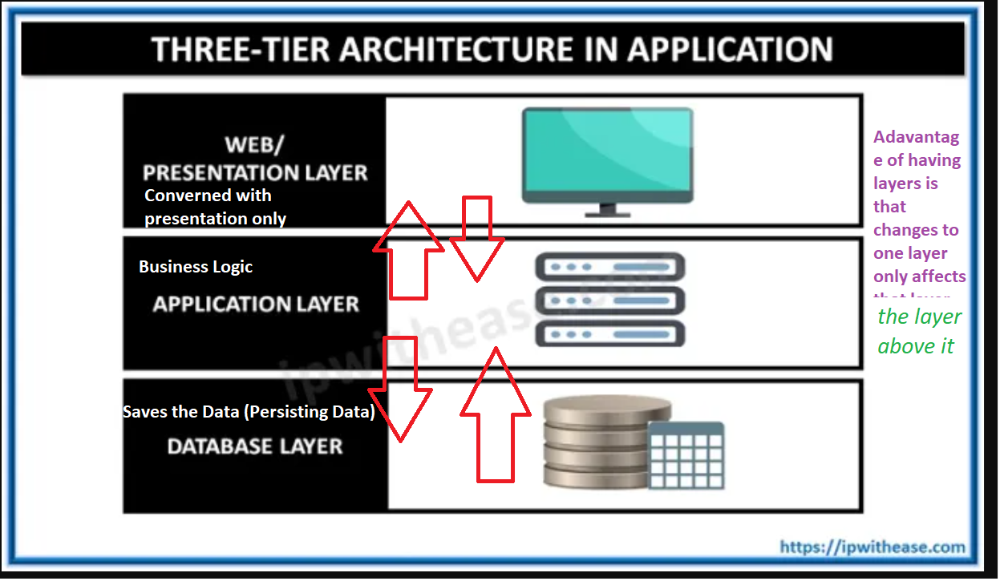
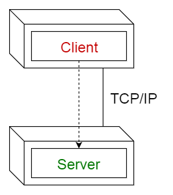
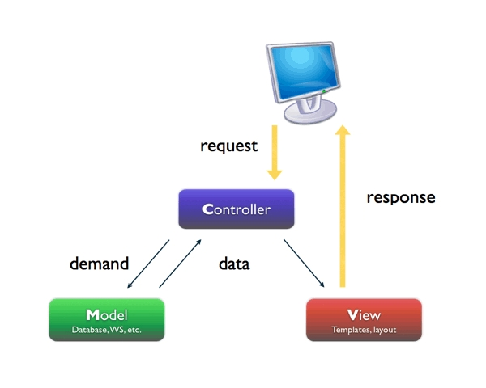

# CSCI 370 Lecture 19: Software Architecture Patterns

## Three-Tier Architecture and N-Layer Architecture

### Key Advantages:

1. **Minimized Retesting:**

   - Changing a layer may require retesting all layers above it but not the layers beneath it, reducing the scope of retesting.

2. **Division of Responsibilities:**

   - Code is divided by functionality, allowing different teams with specialized skills to work on separate layers without interference.

3. **Independent Testing:**

   - Each layer can be tested independently since they are not interdependent.

4. **Layer Swapping:**
   - One layer can be replaced without affecting other layers.

---

## Issues Specific to Web Applications

1. **Security:**

   - Web applications are exposed to the entire world, making them vulnerable to attacks.

2. **Browser Dependency:**

   - Applications rely on web browsers for security and functionality.

3. **Internet Speed:**

   - Performance depends on internet speed, necessitating some client-side programming.

4. **Plain HTML Limitations:**

   - Basic HTML pages are unappealing and require significant effort to make them engaging.

5. **Graphics Control:**

   - Limited control over graphics in web applications.

6. **State Management:**

   - Web applications must manage the state of all connected browsers.

7. **Database Bottlenecks:**
   - Handling data on a single database server can become a bottleneck, especially with SQL.

---

## Non-Functional Requirements and Their Impact on Architecture

### Definition:

Non-functional requirements are implicit requests that affect the entire program. Failure to meet these requirements can jeopardize the project.

### Examples:

1. **Performance:**

   - Critical operations should be localized within a small number of components.
   - Minimize database and internet communication.
   - Example: Alexa relies on the internet, while Tesla requires immediate local processing.

2. **Security:**

   - Use a layered structure with critical assets in the innermost layers.

3. **Safety:**

   - Co-locate safety-related operations in a single or small number of components for easier validation.

4. **Maintainability:**
   - Use fine-grain, self-contained components to simplify changes and reduce the risk of breaking other parts of the system.

---

## Architectural Patterns

### 1. Layered Pattern

- **Layers:**

  - Presentation Layer (UI Layer)
  - Application Layer (Service Layer)
  - Business Logic Layer (Domain Layer)
  - Data Access Layer (Persistence Layer)

- **Usage:**
  - General desktop applications.
  - E-commerce web applications.

---

### 2. Client-Server Pattern

- **Description:**

  - Consists of a server providing services to multiple clients.
  - Clients request services, and the server responds.

- **Usage:**
  - Online applications, email, document sharing, banking, and database servers.

---

### 3. Pipe-Filter Pattern

- **Description:**

  - Structures systems that process a stream of data.
  - Each processing step is enclosed in a filter component, and data flows through pipes.

- **Usage:**
  - Compilers (lexical analysis, parsing, semantic analysis, code generation).
  - Workflows in bioinformatics.

---

### 4. Peer-to-Peer Pattern

- **Description:**

  - Components (peers) act as both clients and servers.
  - Peers can dynamically change roles.

- **Usage:**
  - File-sharing networks (e.g., Gnutella, G2).
  - Multimedia protocols (e.g., P2PTV, PDTP).
  - Cryptocurrency (e.g., Bitcoin, Blockchain).

---

### 5. Model-View-Controller (MVC) Pattern

- **Description:**

  - Divides an interactive application into three parts:
    1. **Model:** Core functionality and data.
    2. **View:** Displays information to the user.
    3. **Controller:** Handles user input.

- **Usage:**
  - Architecture for web applications in major programming languages.

---

## Summary

This lecture covered various software architecture patterns, their advantages, and their applications. Key topics included the three-tier architecture, issues specific to web applications, non-functional requirements, and common architectural patterns such as Layered, Client-Server, Pipe-Filter, Peer-to-Peer, and MVC. Understanding these patterns is crucial for designing robust, maintainable, and efficient software systems.
