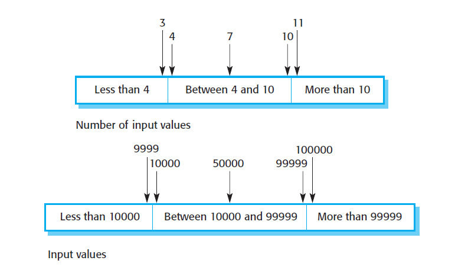

# CSCI 370 Lec 20: Software Testing and Testable Software

## Regression Testing

- **Definition**: Bugs in software that were fixed reappear.
- **Process**:
  1. Identify the bug.
  2. Fix the bug.
  3. Create a test for the bug.
  4. Continuously run the test to ensure the bug does not return.
- **Tools**: Automated testing software is often used to simplify this process.

## Test-Driven Development (TDD)

- **Definition**: Write tests before writing the code.
- **Steps**:
  1. **Red Light**: Write a test that fails because the code does not exist yet.
  2. **Green Light**: Write the code to make the test pass.
  3. **Refactor**: Clean up the code while ensuring the test still passes.
- **Advantages**:
  1. Tests run automatically with every code check-in.
  2. Tests return clear results (true/false).
  3. Encourages developers to focus on the code they are about to write.
  4. Ensures that every piece of code has a corresponding test.
  5. Provides quick feedback and increases confidence in the code.
  6. Facilitates continuous integration.

## Five Stages of Testing

1. **Development Testing**:

   - Includes unit testing (TDD), component testing, and system testing.
   - Focuses on finding bugs and defects.

2. **Component Testing**:

   - Tests interactions between related groups of objects.

3. **System Testing**:

   - Tests the entire system as a whole.
   - Focuses on component interactions and finding defects like crashes or incorrect computations.

4. **Release Testing**:

   - Conducted by a separate team to validate that the system meets stakeholder requirements.
   - Types:
     - **Alpha Testing**: Early testing by a small group of users.
     - **Beta Testing**: Wider testing by a larger group of users.
     - **Acceptance Testing**: Final testing by customers to decide if the software is ready for deployment.

5. **User Testing**:
   - Performed by end-users in their own environment.

## Testing Techniques

### Partition Testing

- Identify groups of inputs with common characteristics.
- Focus on edge cases (e.g., maximum and minimum values).

Example:

```java
assertTrue(add(1, 2) == 3);
assertTrue(add(Integer.MAX_VALUE, -1) == Integer.MAX_VALUE - 1);
assertTrue(add(Integer.MAX_VALUE, 1) == Integer.MIN_VALUE); // Overflow test
```

### Guideline-Based Testing

- Use experience to identify common errors.
- Examples:
  - Overwhelming the system (e.g., ordering 10,000 items).
  - Passing null values to methods.

### Black-Box vs. White-Box Testing

- **Black-Box Testing**: Test without knowledge of the internal code.
- **White-Box Testing**: Test with full knowledge of the internal code.

## Testable Software

1. **Methods Should Return a Value**:

   - Avoid void methods as they are harder to test.

2. **Predictable Results**:

   - Avoid randomness in methods.

3. **Environment Independence**:
   - Software should not rely on specific hardware or environments.
   - Example: Self-driving car software can be tested without a physical car.

## Continuous Integration and Pipelines

- **Definition**: Automate the process of integrating code changes and running tests.
- **Goal**: Minimize lag time between code check-in and feedback.

---


