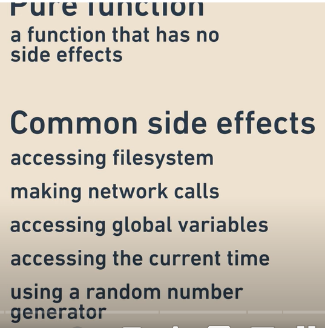
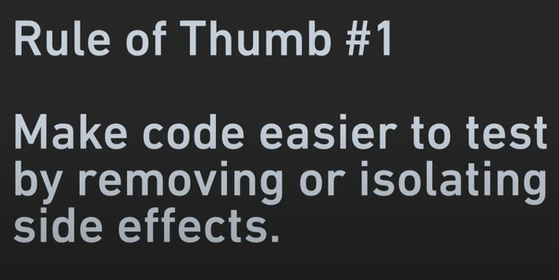
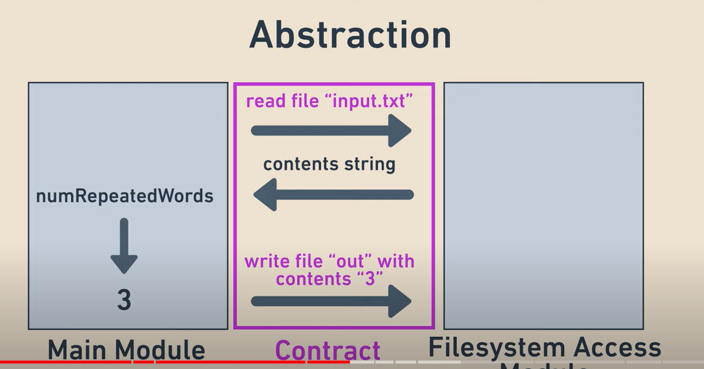
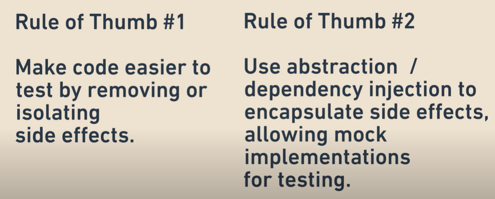
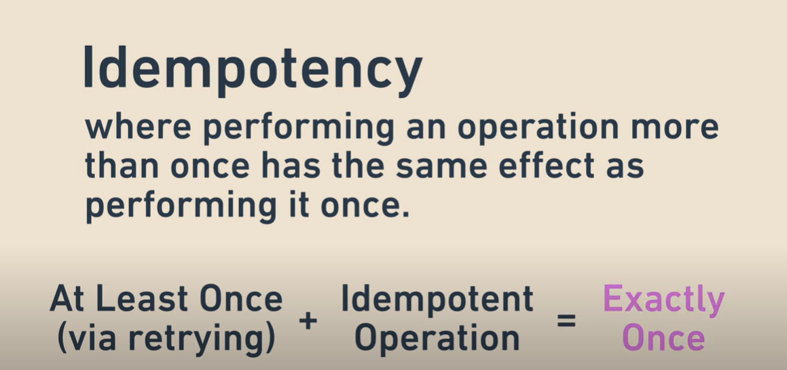

# Lec 21: Writing Testable Code

## Key Concepts

### Characteristics of Testable Software

1. **Methods Should Return a Value**: This allows the results to be tested.
2. **Predictable Results**: Avoid using elements like random number generators that make testing difficult.
3. **Environment Independence**: Software should not rely on specific environments. For example, self-driving car software can be tested without an actual car.

### Seams in Code

A seam is a break in the code that allows testing of specific parts. Without seams, testing becomes difficult. For example:

#### Code Without Seams

```java
class Business {
    Business(int i) {
        i = i / 0; // Logic directly in the constructor
    }
}
```

#### Code With Seams

```java
class Business {
    Business(int i) {
        i = handleI(i); // Logic moved to a separate method
    }

    int handleI(int i) {
        return i / 0;
    }
}
```

By moving logic to a separate method, the code becomes testable.

### Dependency Injection

Dependency injection allows control over the dependencies of a class, making it easier to test. For example:

#### Using Real Dependencies

```java
Portfolio portfolio = new Portfolio(new RealStockMarket());
portfolio.valueOfPortfolio();
```

#### Using Mock Dependencies for Testing

```java
Portfolio portfolio = new Portfolio(new MockStockMarket());
portfolio.valueOfPortfolio();
```

Mock objects allow predictable and controlled testing environments.

### Law of Demeter

The Law of Demeter suggests that methods should only use the properties or methods of the objects passed to them directly, not their "grandchild" objects. For example:

#### Violating the Law of Demeter

```java
void process(A a) {
    a.getB().getC().doSomething();
}
```

#### Following the Law of Demeter

```java
void process(C c) {
    c.doSomething();
}
```

This makes the code easier to understand and test.

### Idempotency in Unit Tests

Unit tests should be idempotent, meaning they should always produce the same result regardless of how many times they are run or in what order. For example:

- Uploading a picture should behave the same way every time.

### Isolating Side Effects

Side effects, such as writing to a file or relying on global variables, should be isolated into separate methods. This ensures the core logic can be tested independently. For example:

#### Code With Side Effects

```java
void countWords(String inputFile, String outputFile) {
    // Reads from inputFile and writes to outputFile
}
```

#### Code With Isolated Side Effects

```java
int countWords(InputStream input) {
    // Core logic for counting words
}

void writeResult(OutputStream output, int wordCount) {
    // Handles writing the result
}
}
```

By isolating side effects, the `countWords` method can be tested independently using mock streams.

## Images








## Summary

- Use seams to make code testable.
- Apply dependency injection to control dependencies.
- Follow the Law of Demeter to simplify code and testing.
- Ensure unit tests are idempotent.
- Isolate side effects to separate methods for better testability.
