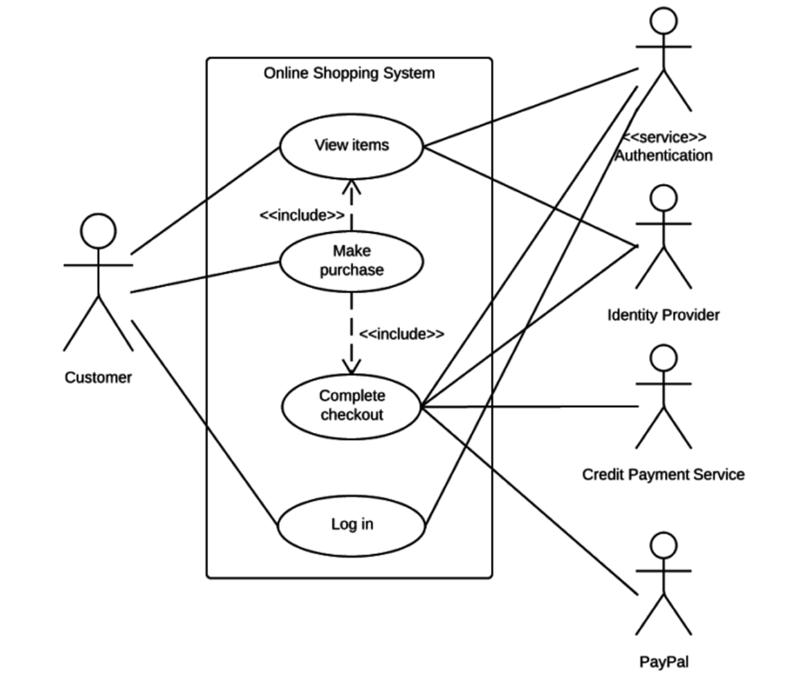
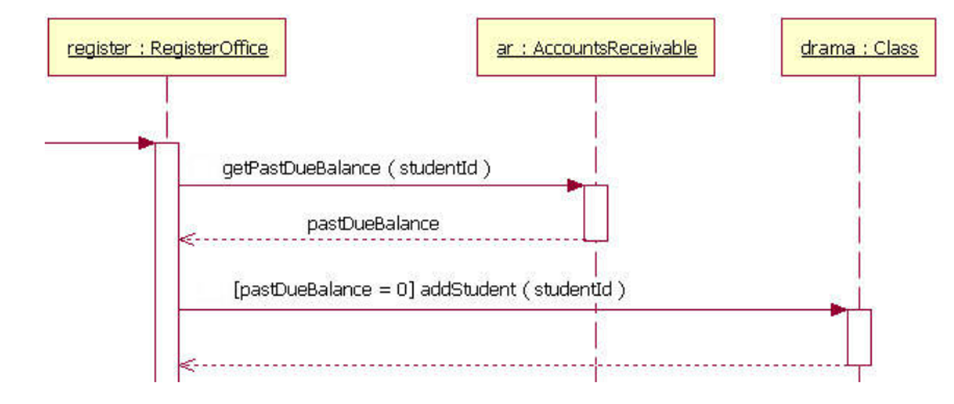
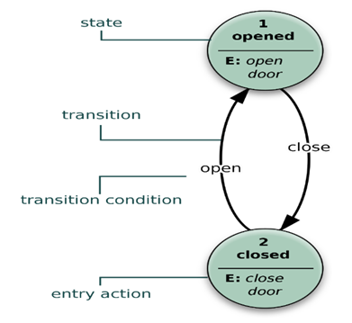
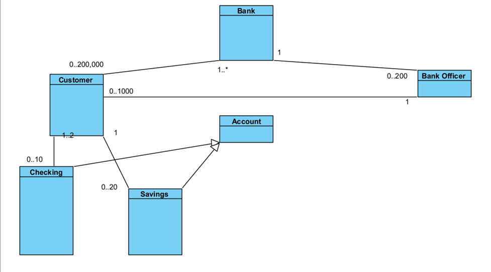
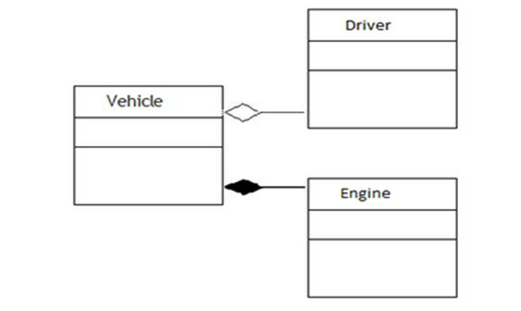
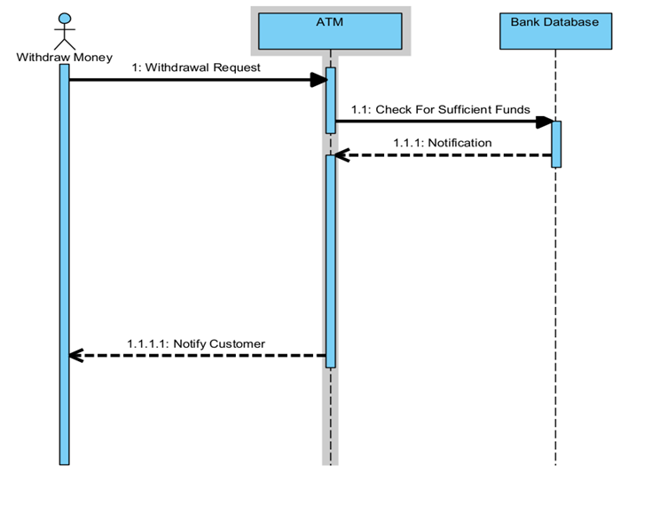
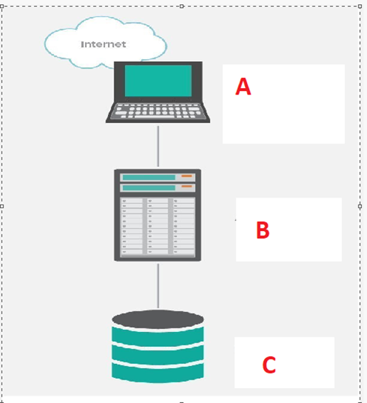

# Sample Final

CS 370 Software Engineering Sample Final (Summer 2022)

There may be more than one answer to a question. Choose the best answer to each question. To get any credit for matching questions, all matches must be correct.

Note, if you wish, you can write an explanation next to your answer.

### Q1) CD/CI (pipeline):

1\) CD stands for Configuration Development  
2\) Makes frequent deliveries of software  
3\) CI stands for Configuration Integration  
4\) Is used together with the Waterfall process  
5\) Should occur once every month

<details>
<summary>Show Answer</summary>

<b>Correct Answer:</b> 2) Makes frequent deliveries of software

</details>

&nbsp;

### Q2) A Non-Functional Requirement

1\) Is usually implied from a Functional one.  
2\) Is an unnecessary requirement.  
3\) Is a requirement that cannot be made to work.  
4\) Usually has a smaller scope than a functional one  
5\) Is not related to customer satisfaction.

<details>
<summary>Show Answer</summary>

<b>Correct Answer:</b> 1) Is usually implied from a Functional one.

</details>

&nbsp;

### Q3) RE: the diagram below:

1\) “Credit Payment Service” must log in.  
2\) Customer can only perform two activities.  
3\) Paypal is a service not an Actor.  
4\) Complete Checkout interacts with the most Actors.  
5\) Is a Context diagram (it's a Use Case diagram)



<details>
<summary>Show Answer</summary>

<b>Correct Answer:</b> 4) Complete Checkout interacts with the most Actors.

</details>

&nbsp;

### Q4)



### Q4) In the above diagram, which Object is activated the most?

<details>
<summary>Show Answer</summary>

<b>Correct Answer:</b> [Provide the correct answer here if known]

</details>

&nbsp;

### Q5) How many lifelines are there?

<details>
<summary>Show Answer</summary>

<b>Correct Answer:</b> [Provide the correct answer here if known]

</details>

&nbsp;

### Q8) The following pattern is typically used for undoing user actions.

1\) Observer Pattern - adding observers w/out modifying existing code  
2\) Strategy Pattern - Separate the code that changes into a separate object which is then passed to code that does not change. Placing algorithms in a separate object that is passed into another class. encapsulating behavior into separate classes.  
3\) Factory Pattern - Controls which class gets created. Does not allow programmers to create a specific class.  
4\) Command Pattern - placed commands into objects and has two commands execute and unexecute. These commands can be saved for reuse.  
5\) Iterator Pattern - e.g. List of Students in a school. The School hides the internal storage of the student list from other objects. Therefore other objects traversal through the Students without knowing how the Student list is being stored.  
6\) State Pattern - Have separate pre-defined states for different conditions  
7\) Decorator - chain together multiple objects and treat them as one object. i.e. getPrice can get the price of many types of condiments.  
8\) Memento - placing a snapshot of an object in another object  
9\) Builder - 1) protects an object from bad values  
 2) also it breaks parameters into smaller understandable parts  
10\) Singleton - protects a global variable (i.e static) from bad values

<details>
<summary>Show Answer</summary>

<b>Correct Answer:</b> 4) Command Pattern

</details>

&nbsp;

### Q9) The following is not good software practice:

1\) De-Coupled Code  
2\) Using inheritance to handle different behaviors  
3\) Strategy Pattern  
4\) Using composition to handle different behaviors  
5\) Using interface types for method parameters

<details>
<summary>Show Answer</summary>

<b>Correct Answer:</b> 2) Using inheritance to handle different behaviors

</details>

&nbsp;

### Q10) A state diagram:

1\) Focuses on changes to a system/object during program execution  
2\) Sequence of messages between objects in an interaction (sequence diagram)  
3\) Represents the goals of systems and users (requirements/checklist/use case table)  
4\) The interactions between a system and other actors with which the system is designed to interface (context diagram)  
5\) An informal, general explanation of a software feature written from the perspective of the end user or customer (user story)

<details>
<summary>Show Answer</summary>

<b>Correct Answer:</b> 1) Focuses on changes to a system/object during program execution

</details>

&nbsp;

### Q11) The following is a non-functional requirement:

1\) Scalability - ability of software to grow (or shrink)  
2\) Page Color  
3\) Business Rule  
4\) Report  
5\) Search Feature

<details>
<summary>Show Answer</summary>

<b>Correct Answer:</b> 1) Scalability - ability of software to grow (or shrink)

</details>

&nbsp;

### Q12) Non-functional vs functional requirement:

1\) A missing functional requirement usually causes the software to be unusable by the user  
2\) A missing non-functional requirement usually causes the software unusable by the user  
3\) Software performance is a functional requirement  
4\) Web page background color is a non-functional requirement  
5\) Non-Functional requirements are easy to test

<details>
<summary>Show Answer</summary>

<b>Correct Answer:</b> 2) A missing non-functional requirement usually causes the software unusable by the user

</details>

&nbsp;

### Q13) A lifeline is found in the following diagram:

1\) Sequence Diagram  
2\) Interactive Diagram  
3\) Class Diagram  
4\) Object Oriented Diagram  
5\) Context Diagram

<details>
<summary>Show Answer</summary>

<b>Correct Answer:</b> 1) Sequence Diagram

</details>

&nbsp;

### DP3) Which Design Pattern is shown in the code below?

<details>
<summary>Show Answer</summary>

<b>Correct Answer:</b> [Provide the correct answer here if known]

</details>

&nbsp;

### DP3 Explain)

<details>
<summary>Show Answer</summary>

<b>Correct Answer:</b> [Provide the correct answer here if known]

</details>

&nbsp;

```java
public class Session {

    private static Session _session = null;

    public Session getSession() {

        if (_session == null)
            _session = new Session();

        return (_session);
    }
}

public interface MathFunctions {

    double multiply(double a, double b);

    double divide(double a, double b);
}

public class Calculator implements MathFunctions {

    @Override
    public double multiply(double a, double b) {
        return (a * b);
    }
}
```

### OOP15) Anything wrong with the code above?

<details>
<summary>Show Answer</summary>

<b>Correct Answer:</b> Calculator is not implementing the divide method

</details>

&nbsp;

### Q15) The diagram below is a:



1\) Activity Diagram  
2\) Use Case Diagram  
3\) Door Diagram  
4\) Timing Diagram  
5\) State Diagram

<details>
<summary>Show Answer</summary>

<b>Correct Answer:</b> 5) State Diagram

</details>

&nbsp;

### Q16 and Q17)



Based on the diagram above:

### Q16) Customer can have, at most, this many accounts.

<details>
<summary>Show Answer</summary>

<b>Correct Answer:</b> 30

</details>

&nbsp;

### Q17) Bank Officers can have, at most, this many Customers.

<details>
<summary>Show Answer</summary>

<b>Correct Answer:</b> 1000

</details>

&nbsp;

### Q18) Match the terms on the left with terms on the right. (All choices must be correct to get credit for this)

<div style="display: flex; justify-content: space-between; align-items: flex-start; gap: 20px;">
  <div>
    <p>Waterfall Process ________</p>
    <p>Incremental Process ________</p>
    <p>Software Re-Use ________</p>
    <p>Client Server ________</p>
  </div>
  <div>
    <p>4) Airplane Flying Software</p>
    <p>3) Allows many changes</p>
    <p>2) Using Open-Source Software</p>
    <p>1) Email Program</p>
  </div>
</div>

<details>
<summary>Show Answer</summary>

<p>Waterfall Process - 4) Airplane Flying Software</p>
<p>Incremental Process - 3) Allows many changes</p>
<p>Software Re-Use - 2) Using Open-Source Software</p>
<p>Client Server - 1) Email Program</p>

</details>

&nbsp;

### Q19) Which are attributes of Good Software

A) Acceptability and Usability (easy to use)  
1\) Dependability and security (won't crash and will protect data)  
2\) Efficiency (won’t waste resources)  
3\) Maintainability (easy to fix)  
4\) C  
5\) A, B  
6\) A, C, D  
7\) A, B, C, D  
8\) None of the above

<details>
<summary>Show Answer</summary>

<b>Correct Answer:</b> 7) A, B, C, D

</details>

&nbsp;

### Q20)



### Q20) The diagram above shows:

1\) Inheritance vs Aggregation  
2\) Aggregation vs Abstraction  
3\) Composition vs Aggregation  
4\) Engine does not require a vehicle  
5\) Vehicle requires an Engine.

<details>
<summary>Show Answer</summary>

<b>Correct Answer:</b> 3) Composition vs Aggregation

</details>

&nbsp;

### Q21) Dependency Inversion Principle

1\) Encourages using interfaces as opposed to concrete classes  
2\) Encourages code decoupling  
3\) Specifies that high level modules should not depend on low level modules.  
4\) 1, 3 above  
5\) 1, 2, 3

<details>
<summary>Show Answer</summary>

<b>Correct Answer:</b> 5) 1, 2, 3

</details>

&nbsp;

```java
// Account depends on SqlServer therefore Sqlserver is lower than Account therefore
// SqlServer is considered to be lower than Account because is depending on it
// dependency inversion replaces the concrete dependency with abstraction i.e. the interface. Replace SqlServer with IDatabase

class Account {
    SqlServer database;
}

class SqlServer {

}
```

### Q23) The code above:

1\) Violates the Open Closed Principle  
2\) Violates the Abstraction Principle.  
3\) Violates the Encapsulation Principle.  
4\) Uses the Singleton pattern  
5\) Uses the Factory Pattern

<details>
<summary>Show Answer</summary>

<b>Correct Answer:</b> [Provide the correct answer here if known]

</details>

&nbsp;

### Q24) The following tests are valid Unit Tests:

```java
public class MathTest {

    @org.junit.jupiter.api.Test
    void test1() {
        Math math = new Math();
        System.out.println(math.Execute("add", 1, 2));
    }

    @org.junit.jupiter.api.Test
    void test2() {
        Math math = new Math();
        assertTrue(math.Execute("add", 1, 2) == 4);
    }

    @org.junit.jupiter.api.Test
    void test3() {
        Math math = new Math();
        assertFalse(math.Execute("add", 1, 2) == 3);
    }

    @org.junit.jupiter.api.Test
    void test4() {
        Math math = new Math();
        assertFalse(math.Execute("add", 1, 2) == 4);
    }
}
```

<details>
<summary>Show Answer</summary>

<b>Correct Answer:</b> test2(), test3(), test4()

</details>

&nbsp;

### Q25) The class above uses the:

```java
public class CustomerId {

    static private int id = 100;

    public int getId() {
        return id++;
    }
}
```

1\) Factory Pattern  
2\) Observer Pattern  
3\) Singleton Pattern  
4\) State Pattern  
5\) None Of The Above

<details>
<summary>Show Answer</summary>

<b>Correct Answer:</b> 3) Singleton Pattern

</details>

&nbsp;

### Q26) YouTube allows many people to subscribe to multiple channels. This is like which design pattern.

1\) Factory Pattern  
2\) Observer Pattern  
3\) Singleton Pattern  
4\) State Pattern  
5\) Builder Pattern

<details>
<summary>Show Answer</summary>

<b>Correct Answer:</b> 2) Observer Pattern

</details>

&nbsp;

### Q27) Ethnography in Software Engineering refers to:

1\) Customer Age  
2\) User Politics  
3\) User Culture  
4\) Customer Ethics  
5\) Customer Location

<details>
<summary>Show Answer</summary>

<b>Correct Answer:</b> 3) User Culture

</details>

&nbsp;

### Q28) Match the term on the left with the description on the right

Presentation Layer \_\_\_\_\_\_\_ 1) Often includes a User Story (Who, What, Why, Acceptance Criteria)  
Controller Layer \_\_\_\_\_\_\_ 2) Model View Controller architecture  
Software validation \_\_\_\_\_\_\_ 3) 3 tier architecture(presentation/business/database)  
Software Requirements \_\_\_\_\_\_\_ 4) TDD- Unit testing

<details>
<summary>Show Answer</summary>

<b>Correct Answer:</b> [Provide the correct answer here if known]

</details>

&nbsp;

### Q29)



### Q29) Regarding the diagram above:

The object that takes the least time is the Actor.  
The database is needed to withdraw money.  
There are no return messages.  
Withdrawal request is stored in the database.  
ATM and Database have a “IS-A” relationship

<details>
<summary>Show Answer</summary>

<b>Correct Answer:</b> [Provide the correct answer here if known]

</details>

&nbsp;

### Q30) The following will usually cause code to be refactored: (changing code leads to code refactoring)

1\) Changing Requirements  
2\) Incremental Development Process  
3\) New Features  
4\) All of the above  
5\) None of the above

<details>
<summary>Show Answer</summary>

<b>Correct Answer:</b> 4) All of the above

</details>

&nbsp;

### Extra Credit: (3 Points)

What type of arguments will cause code to crash?

guidelines - null value, large value, small value,  
partition based -  
test 1 - less than what is expected  
test 2 - more than what is expected  
test 3 - what is expected

<details>
<summary>Show Answer</summary>

<b>Correct Answer:</b> [Provide the correct answer here if known]

</details>

&nbsp;

### Q31) What is not true about Unit Testing:

1\) Allows testing of individual parts of the software.  
2\) Team can execute unit testing before the culmination of the development process.  
3\) Reduces the cost of testing, as defects are identified and fixed in the early stages of development.  
4\) Increases the reliability of the code.  
5\) Allows for testing interactions between various parts of the code.

<details>
<summary>Show Answer</summary>

<b>Correct Answer:</b> [Provide the correct answer here if known]

</details>

&nbsp;

### Q32) Which architecture pattern is associated with a Web page?

1\) Layered pattern  
2\) Client-server pattern  
3\) Pipe-filter pattern  
4\) Model-view-controller pattern  
5\) NTier pattern

<details>
<summary>Show Answer</summary>

<b>Correct Answer:</b> 4) Model-view-controller pattern

</details>

&nbsp;

### Q32) Which architecture pattern is associated with an E-Mail program?

1\) Layered  
2\) Client-server pattern  
3\) Pipe-filter pattern  
4\) Model-view-controller pattern  
5\) NTier pattern

<details>
<summary>Show Answer</summary>

<b>Correct Answer:</b> 2) Client-server pattern

</details>

&nbsp;

### Q33)



### Q33) In the diagram above, A represents:

1\) Presentation Layer  
2\) Business Layer  
3\) Database Layer  
4\) Persistence Layer  
5\) Logic Layer

<details>
<summary>Show Answer</summary>

<b>Correct Answer:</b> 1) Presentation Layer

</details>

&nbsp;

### Which type of testing would a developer probably do?

1\) Black box - hidden from developer  
2\) White box - developer knows the code  
3\) Acceptance - client  
4\) Release - not developer  
5\) Graphical User Interface - customer/GUI expert/graphical artist

<details>
<summary>Show Answer</summary>

<b>Correct Answer:</b> 2) White box - developer knows the code

</details>

&nbsp;

### If I want to test the divide function below using “Guideline-based testing” and I already tested divide(1,2) and it correctly returned .5, what other values should I test for in the denominator?

```java
public class Math {

    double divide(double numerator, double denominator) {
        return numerator / denominator;
    }
}
```

1\) 3  
2\) 4  
3\) 0  
4\) 5  
5\) 6

<details>
<summary>Show Answer</summary>

<b>Correct Answer:</b> 3) 0

</details>

&nbsp;

### Things to know:

- Ethnography
- Software evolution - new versions/maintenance
- The diagrams
- Difference between state and activity - state is for only one object water/vapor/ice
- Multiplicity
- Pipe filter
- Static = global
- Review process diagram
- Web browser - always client/server
- Remember which non-functional specs require which architecture
  - Performance - immediate response code should be together (same platform)
  - Safety - code together easier to review for flaws
  - Security - security layer on top
  - Maintainability - code that is easy to change - usually small methods are safest to modify w/out creating bugs
- Scrum - product backlog - wish list
  - Scrum backlog - for each sprint
  - Potential release candidate
  - Daily standup
  - Testing
- All the terms are the same.. i.e. incremental, agile, xp, scrum…
- Remember OOP principles
  - SOLID/YAGNI/DRY/prefer composition instead of inheritance/
- Difference between abstract and interface

<style>
  details {
    margin: 10px 0;
  }

  details {
    background-color:rgb(81, 161, 247);
    color: white;
    padding: 10px 20px;
    border: none;
    border-radius: 5px;
    cursor: pointer;
    font-weight: bold;
    text-align: center;
    transition: background-color 0.3s;
    display: inline-block;
  }

  details:hover {
    background-color: #0056b3;
  }

  details[open] {
    background-color: #28a745;
  }

</style>
